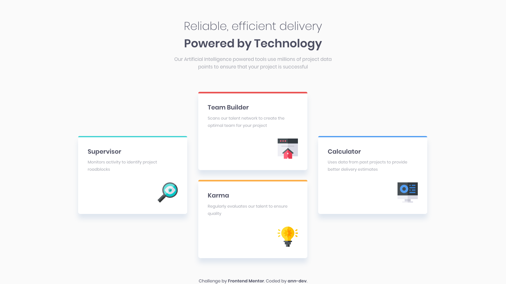

<h1 align="center">Four card feature section</h1>

<h3 align="center"><a href="https://ann-dev.github.io/fem-cards-section/" target="_blank">✨ Live Demo</a></h3>

  
  

Responsive page design challenge: cards section, CSS-grid based.  
My solution for one of challenges for
  <a href="https://www.frontendmentor.io/profile/ann-dev">frontendmentor.io</a>

### Usage

It's a static HTML page - just open it in your default web browser. For compiling SCSS you can use Node-Sass or a VsCode plugin.

### 📝 License

Copyright © 2020 [ann-dev](https://github.com/ann-dev).

This project is [MIT](https://github.com/ann-dev/frontend-mentor-challenges/blob/master/LICENSE) licensed.
